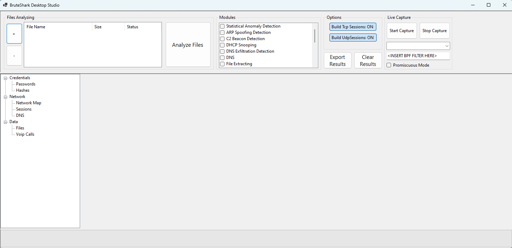
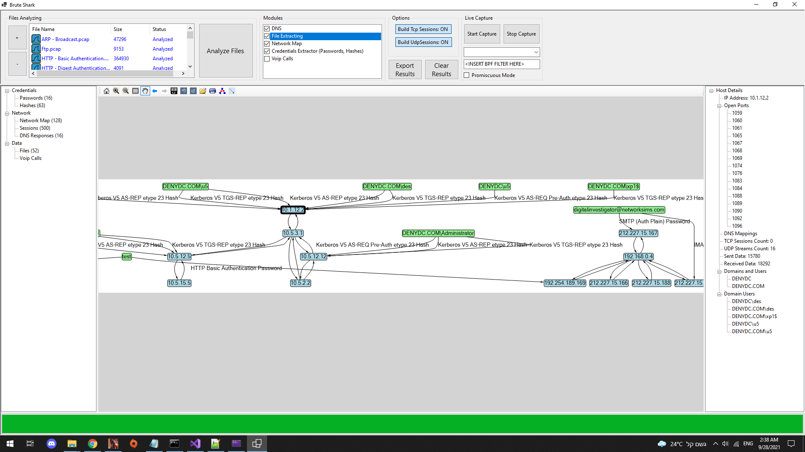
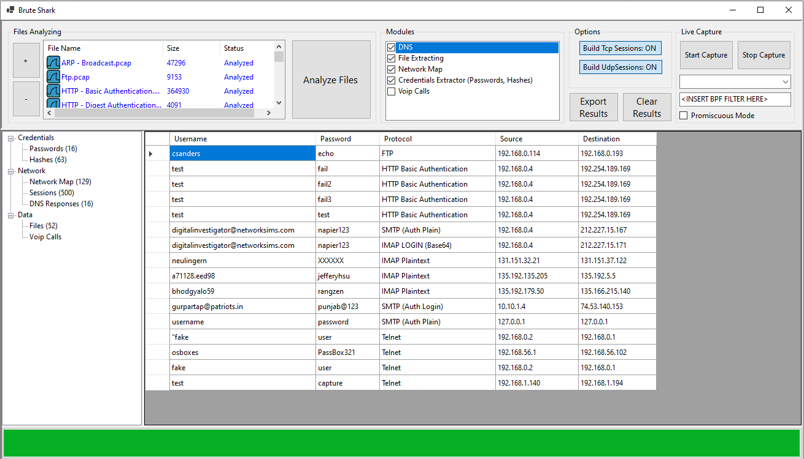
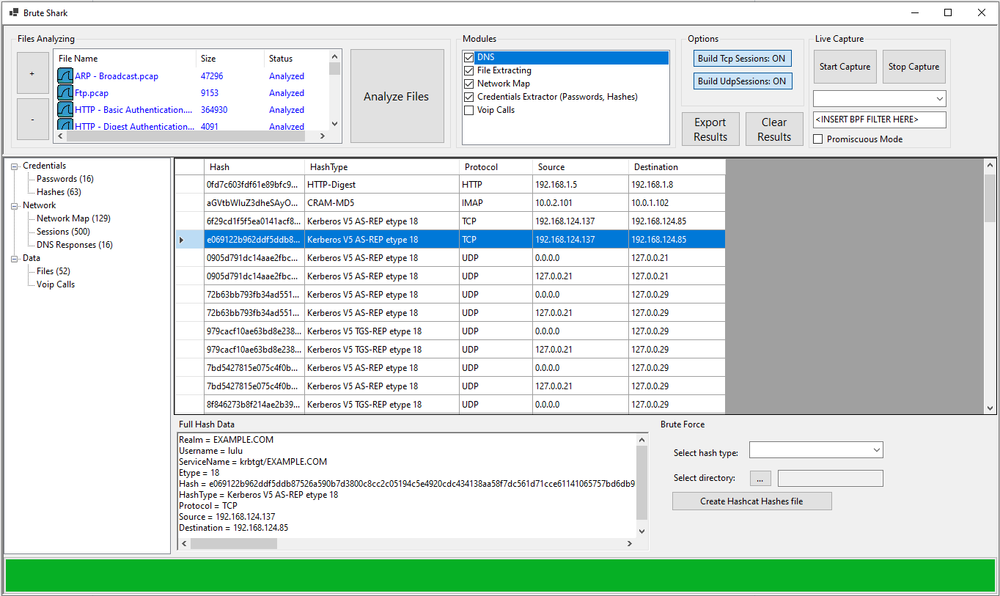
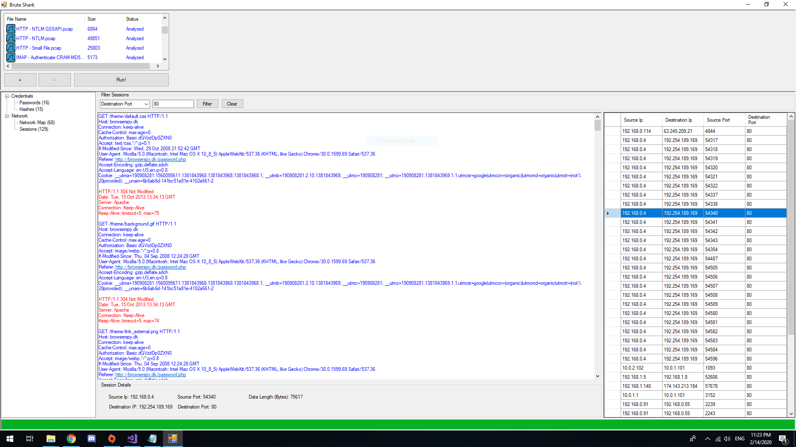
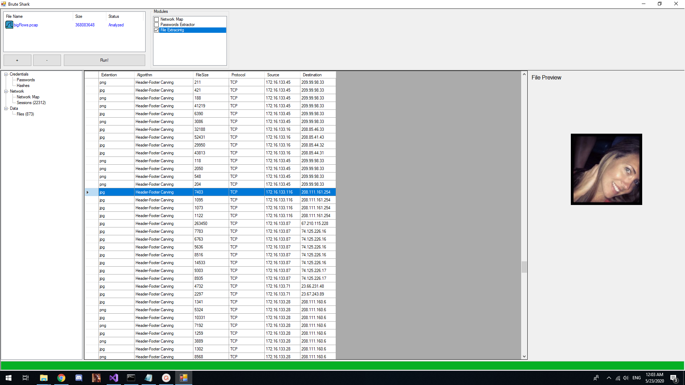
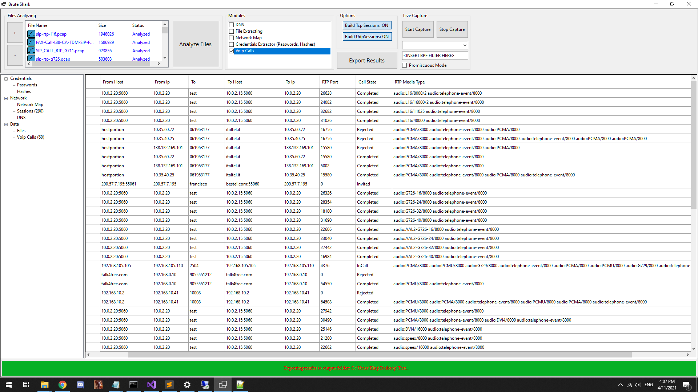

# 🦁 BruteShark Studio v2.0

**Professional Network Forensic Analysis Toolkit for Windows**

[](https://github.com/Ayman-Elbanhawy/BruteSharkStudioPro/releases)
[](https://github.com/Ayman-Elbanhawy/BruteSharkStudioPro)
[](LICENSE)
[](https://github.com/Ayman-Elbanhawy/BruteSharkStudioPro)

BruteShark Studio is a desktop-focused network forensic analysis platform for reviewing packet captures, extracting credentials and authentication hashes, detecting C2 beacons, fingerprinting TLS/SSH, identifying anomalies, reconstructing TCP/UDP sessions, exporting investigation artifacts in 14 formats, and running Hashcat — all from an intuitive dark-themed desktop interface or automated CLI pipeline.

Repository: <https://github.com/Ayman-Elbanhawy/BruteSharkStudioPro>

Full Help Manual: [`docs/BruteSharkStudioHelp.html`](./docs/BruteSharkStudioHelp.html)

---

## 📥 Download

| Format | Link |
|--------|------|
| **MSI Installer (ZIP)** | [`release/BruteSharkDesktopStudioInstaller.zip`](./release/BruteSharkDesktopStudioInstaller.zip) |
| **Direct MSI** | [`release/BruteSharkDesktopStudioInstaller.msi`](./release/BruteSharkDesktopStudioInstaller.msi) |
| **GitHub Download** | [Raw ZIP link](https://github.com/Ayman-Elbanhawy/BruteSharkStudioPro/blob/main/release/BruteSharkDesktopStudioInstaller.zip?raw=1) |

Bundles Hashcat v6.2.6 with 30+ rule files. Adds Hashcat to system PATH during elevated install.

---

## 📸 Screenshots

### Main Window (v2.0 — Dark Theme)


### Network Map


### Hashcat Workflow


<details>
<summary><strong>More Screenshots</strong></summary>

| View | Screenshot |
|------|-----------|
| Passwords |  |
| Hashes |  |
| TCP Sessions |  |
| File Carving |  |
| VoIP Calls |  |
| CLI (GIF) |  |

</details>

---

## 🔥 What's New in v2.0

### 🛡️ Threat Detection
- **C2 Beacon Hunting** — statistical analysis of connection timing to identify periodic callback behavior
- **JA3/JA3S Fingerprinting** — TLS client/server fingerprinting with 13 known-malicious signatures
- **Detection Rule Engine** — 12 built-in rules + YARA rule loading for custom detection
- **DNS Exfiltration Detection** — entropy/length-based detection of DNS tunneling
- **Payload Pattern Scanning** — regex-based scanning for shells, malware, suspicious strings
- **ARP Spoofing Detection** — ARP cache poisoning / MITM attack identification

### 🔍 Fingerprinting & Protocol Analysis
- **TLS Certificate Extraction** — X.509 cert parsing with suspicious cert detection (self-signed, expired, long validity)
- **SSH Fingerprint** — host key extraction & key-change detection for MITM monitoring
- **HTTP Metadata** — request/response headers, User-Agent tracking, URL extraction
- **SMB Dissector** — NTLM over SMB, named pipe detection, share enumeration
- **DHCP Snooping** — rogue DHCP server detection, lease tracking, starvation attacks
- **Flow Aggregation** — NetFlow-style 5-tuple flow records with byte/packet statistics
- **Anomaly Detection** — statistical baselining for bandwidth spikes, packet rate anomalies, unusual ports

### 🔐 Expanded Credential Extraction (19 Parsers)
New in v2.0: **POP3**, **RDP NLA**, **VNC**, **SNMP**, **IRC**, **IMAP**

### 📊 Multi-Format Export (14 Formats)
New: **HTML Forensic Reports**, **PDF Reports**, **Zeek-Format Logs** (conn, dns, ssl, http), **STIX 2.0**, **MISP**

### 🌐 REST API
Programmatic access via `http://localhost:8089` — status, results, IOCs, reports, Zeek logs

### 🎨 Professional UI
Dark theme (#1E1E2E), tooltips on all controls, 10 new result view nodes, SQLite case management

---

## ✨ Full Feature List

### 🔐 Credential & Hash Extraction (19 Parsers)

| Protocol / Type | Method |
|----------------|--------|
| **NTLMv1/v2** | SMB, HTTP, LDAP, RDP NLA |
| **Kerberos** | AS-REQ, AS-REP, TGS-REP (RC4, AES128, AES256) |
| **LDAP** | Simple bind |
| **HTTP** | Basic, Digest MD5 |
| **FTP** | USER/PASS |
| **SMTP** | AUTH LOGIN, AUTH PLAIN |
| **IMAP** | LOGIN |
| **POP3** | USER/PASS, APOP |
| **VNC** | Challenge-response |
| **SNMP** | Community strings (v1/v2c) |
| **IRC** | PASS, NickServ |
| **CRAM-MD5** | SMTP/IMAP/POP3 challenge-response |

### 🌐 Network Analysis

- Interactive visual network map with endpoint enrichment
- TCP/UDP session reconstruction with protocol-aware hex viewer
- DNS name-to-IP mapping with query/response pair tracking
- Open port enumeration per host
- BPF capture filter support for live captures
- Promiscuous mode toggle

### 📦 Evidence Extraction

- File carving from TCP streams (50+ file types: images, archives, docs, executables)
- VoIP call reconstruction from SIP/RTP traffic
- Chronological forensic timeline of all detected events
- SQLite case database for persistent investigation management

### 🛡️ Threat Intelligence

- **AbuseIPDB** API v2 integration for IP reputation scoring
- **VirusTotal** API integration for hash/file lookups (optional)
- **JA3 fingerprint database** — 13 known-malicious TLS signatures
- **12 detection rules** — command injection, PHP shells, encoded payloads, SQL injection, XSS
- **YARA rule loading** — external rule file support
- **AbuseIPDB categories** — DDoS, botnet C2, brute-force, port scan, hacking, malware distribution

### 📊 Export Formats (14 Total)

| Format | Description |
|--------|-------------|
| **HTML Report** | Full forensic report — 16 sections, dark theme, collapsible, searchable |
| **PDF Report** | Self-contained PDF — no external dependencies |
| **JSON** | Machine-readable summary of all results |
| **CSV** | Credentials, hashes, connections, DNS |
| **STIX 2.0** | Structured Threat Information for TIP integration |
| **MISP** | Compatible JSON for MISP threat sharing |
| **Zeek conn.log** | TCP/UDP connection records |
| **Zeek dns.log** | DNS query/response pairs |
| **Zeek ssl.log** | TLS handshake metadata |
| **Zeek http.log** | HTTP transactions |
| **Hashcat** | Grouped by hash type, ready-to-crack |
| **TXT Timeline** | Chronological event log |
| **IOC Export** | Indicators of compromise |
| **Raw Files** | Carved files, VoIP audio |

---

## 🔨 Hashcat Integration

### Supported Hashcat Modes

| Hash Type | Mode | Source |
|-----------|------|--------|
| NTLMv1 | 5500 | SMB, HTTP NTLM, LDAP |
| NTLMv2 | 5600 | SMBv2, RDP NLA, LDAP |
| Kerberos AS-REQ (RC4) | 7500 | AD authentication |
| Kerberos AS-REP (RC4) | 18200 | AS-REP roasting |
| Kerberos TGS-REP (RC4) | 13100 | Kerberoasting |
| Kerberos TGS-REP (AES128) | 19600 | Kerberoasting |
| Kerberos TGS-REP (AES256) | 19700 | Kerberoasting |
| HTTP Digest MD5 | 11400 | HTTP Digest auth |
| CRAM-MD5 | 16400 | SMTP/IMAP/POP3 |
| POP3 APOP | 9900 | POP3 APOP |

### GUI Workflow
1. Open the **Hashes** view after analysis
2. Select a hash type, output directory, and wordlist
3. Optionally add extra arguments (e.g., `-r rules/best64.rule`)
4. Click **Crack with Hashcat**

### CLI Workflow
```powershell
BruteSharkDesktopStudioCli -m Credentials -d C:\Captures -o C:\Results --hashcat-wordlist C:\Wordlists\rockyou.txt
```

---

## 🌐 REST API

The desktop app exposes endpoints on `http://localhost:8089`:

| Endpoint | Method | Description |
|----------|--------|-------------|
| `/api/status` | GET | Module list, counts, analysis state |
| `/api/results` | GET | All parsed results (JSON) |
| `/api/credentials` | GET | Passwords and hashes |
| `/api/network` | GET | Connections, DNS, ports |
| `/api/iocs` | GET | Indicators of compromise |
| `/api/report` | GET | Generate HTML report |
| `/api/zeek` | GET | Zeek-format logs |

---

## ⌨️ CLI Usage

```powershell
# Full analysis
BruteSharkDesktopStudioCli -m All -d C:\Captures -o C:\Results

# Credentials + Hashcat
BruteSharkDesktopStudioCli -m Credentials -d C:\Captures -o C:\Results --hashcat-wordlist rockyou.txt

# Single file
BruteSharkDesktopStudioCli -f C:\Captures\suspicious.pcap -o C:\Results

# Live capture
BruteSharkDesktopStudioCli -l "Wi-Fi" -m Credentials,NetworkMap -o C:\Results
```

### CLI Flags

| Flag | Description |
|------|-------------|
| `-m, --modules` | Module list: `All` or comma-separated names |
| `-d, --directory` | Directory of PCAP files |
| `-f, --file` | Single PCAP file |
| `-l, --live` | Live capture interface name |
| `-o, --output` | Output directory |
| `--hashcat-path` | Path to hashcat.exe |
| `--hashcat-wordlist` | Wordlist for cracking |

---

## 🖥️ Desktop Usage

1. Launch **BruteShark Desktop Studio** from desktop shortcut or Start Menu
2. Click **Add Files** and select `.pcap` / `.pcapng` captures
3. Select analysis modules from the checklist (default: all)
4. Keep TCP & UDP session reconstruction ON for full depth
5. Click **Run** — progress bar shows analysis status
6. Click tree nodes to inspect results:
   - **Credentials** → Passwords, Hashes
   - **Network** → Network Map, Sessions, DNS
   - **Detection** → Alerts, Beacons
   - **Fingerprints** → JA3, TLS Certs, SSH
   - **Protocols** → HTTP, SMB, DHCP, ARP
   - **Anomalies** → Statistical detections
   - **Data** → Files, VoIP Calls
7. Click **Export Results** for comprehensive HTML/PDF reports

---

## 🔧 Building from Source

```powershell
# Build the solution
dotnet build .\BruteSharkStudio\PcapProcessor.sln -v:minimal

# Run tests
dotnet test .\BruteSharkStudio\PcapProcessor.sln -v:minimal

# Run the desktop app
dotnet run --project .\BruteSharkStudio\BruteSharkDesktop\BruteSharkDesktop.csproj

# Run the CLI
dotnet run --project .\BruteSharkStudio\BruteSharkCli\BruteSharkCli.csproj -- --help

# Build the MSI installer (requires WiX Toolset v3.11+)
dotnet msbuild .\BruteSharkStudio\BruteSharkDesktopInstaller\BruteSharkDesktopInstaller.wixproj /t:Build /p:Configuration=Debug

# Package for distribution
Compress-Archive -Path .\BruteSharkStudio\BruteSharkDesktopInstaller\bin\Debug\BruteSharkDesktopStudioInstaller.msi -DestinationPath .\release\BruteSharkDesktopStudioInstaller.zip
```

---

## 📁 Repository Layout

```
BruteSharkPro/
├── BruteSharkStudio/                    Solution and source
│   ├── BruteSharkDesktop/              WinForms desktop application
│   ├── BruteSharkCli/                  Command-line interface
│   ├── CommonUi/                        Shared UI, exporting, reporting
│   ├── PcapAnalyzer/                    Analysis engine (16 modules)
│   ├── PcapProcessor/                   Packet capture and reassembly
│   ├── BruteForce/                      Hashcat runner
│   └── BruteSharkDesktopInstaller/      WiX installer project
├── docs/
│   └── BruteSharkStudioHelp.html        Full help manual (dark theme)
├── readme_media/                        Screenshots and images
├── release/                             Built MSI and ZIP
└── Pcap_Examples/                       Sample capture files
```

---

## 📖 Documentation

- **[Full Help Manual](./docs/BruteSharkStudioHelp.html)** — 25+ sections, all features documented, dark-themed
- **[GitHub Issues](https://github.com/Ayman-Elbanhawy/BruteSharkStudioPro/issues)** — Bug reports and feature requests
- **[GitHub Releases](https://github.com/Ayman-Elbanhawy/BruteSharkStudioPro/releases)** — Version history

---

## ⚖️ License

GNU General Public License v3.0

## © Copyright

Code updates and maintenance: **Ayman Elbanhawy** / [softwaremile.com](https://softwaremile.com)
